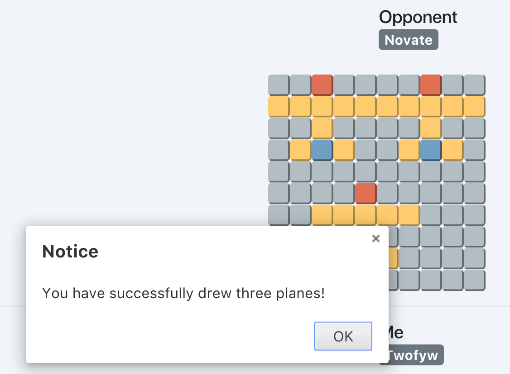

# Bomber Game

- [Game Intro](#game-intro)
- [Installation](#installation)
- [Server Design](#server-design)
- [Client Design](#client-design)
- [Database Design](#database-design)
- [Segment Design](#segment-design)
- [Test Checklist](#test-checklist)

## Game Intro

1. The chessboard is a 10\*10 grid. The coordination is designated in the figure above.
2. The shape of the plane is shown in the figure above. All planes are of the same shape that occupies 10 blocks, including 5 adjacent blocks for wing, 4 adjacent blocks for body, and 3 adjacent blocks for tail.
3. The players will firstly login to the game, and pair up by invitation.
4. Each player randomly draw 3 planes on the chessboard. All planes should not overlap.
5. After both players have drawn all 3 planes, they take turns to guess the location of the opponent's planes. Each player can show their guess by giving a single coordination representing a block on the plane, or a pair of coordinations representing the plane's head and end(middle block of the tail). The invited player will start guessing first.
6. If the guessing player gives a single coordination, the result will be "Wrong", "Plane body(all blocks of a plane without head)", "Plane head".
7. If the guessing player gives a pair of coordinations ,the result will be "Wrong" or "Right".
8. If the guessing player successfully guessed the part or the whole of the plane, the plane will be displayed on the guessing player's chessboard to mark the success.
9. The player who first successfully guessed the location of all three planes of the opponent wins.

## Installation

### Client

Windows 10 and Linux/UNIX based distributions like macOS, Ubuntu are supported. Install latest npm first.

1. Go to the `client` directory.
2. `npm start`.

### Server

We recommend CentOS 7 with MySQL or MariaDB installed.

1. Go to the `server` directory.
2. `make clean && make`
3. Set up database by importing `Database.sql`.
4. Run `./server`.

## Server Design

The server, running as a daemon, has three layers:

- [Application Layer](#application-layer)
- [Presentation Layer](#presentation-layer)
- [Transfer Layer](#transfer-layer)

### Application Layer

The Application Layer, as the top layer, offers the service of the game itself. There are two important modules inside this layer:

1. State Machine Module
2. Database Interaction Module

#### State Machine Module

We control the server by a state machine. The functions of the state machine includes:

- Decide which state the machine is at by checking the type of the incoming segment.
- Decide what server should do regarding to the status of the machine, including how to response to clients and how to pack up segments to send.
- Attribute different statuses for different users.

The state machine has 7 states shown in the table below:

| No. |         State          |                              Description                              |
| :-: | :--------------------: | :-------------------------------------------------------------------: |
|  0  |         Accept         |             A client successfully connected to a server.              |
|  1  |    WaitForPassword     |         The username is given and exists, wait for password.          |
|  2  |     ServerStandBy      | Password correct. Initial status after login without being in a game. |
|  3  | WaitInvitationResponse |        The user invite another for game and wait for response.        |
|  4  |       Responding       |             The user is invited for game and responding.              |
|  5  |          Draw          |      Two users successfully pair up and they are drawing planes.      |
|  6  |          Game          |              Both players have drawn planes. Game start.              |

And the state transition map is shown below, we can also see how each state receives or sends segments(the design of the segments are introduced in the section 'Segment Design' below):

#### Database Interaction Module

We arrange the interaction between server daemon and database to Application Layer, the top layer. Such an interaction is encapsulated into the class of `DataBaseConnection`.

We adopted the design pattern of singleton, which means that we instantiate only one instance of the database interaction class.

The design of the database is introduced in the section 'Database Design' below.

### Presentation Layer

The core function of the presentation layer of the server is to assemble or to disassemble the segments.

Specifically, on the layer upon this layer, the data is arranged by data structures including `string`, `vector`, `list`, `struct`. On the layer below this layer, the data is stored by `char*`, `uint8_t`, etc. which seldomly mistakes but hard to utilize directly for developers. In a word, the data structure of the upper layer is friendly to developers, the data structure of the lower layer is good for the machine to manipulate, while this layer is the converter between the need of the upper layer and the lower layer.

### Transfer Layer

The core function of the transfer layer is to arrange the connection and data transfer of server and clients. The specific functions of this layer are:

- **Maintains the sockets**: Maintaining the listen socket, and sockets that are successfully connected to clients. We store these sockets to `FD_SET`, and do `select()` from the loop of the main function. If the socket can be read, and the buffer is not full, we will read as much data as we can, and write to the looping buffer of the client. Thus, we can get the length of each segment by reading the second to third bytes. More than that, each time writting into buffer, we should memorize whether or not we read the whole segment. If the whole segment is read, we should copy the segment to the upper layer and clean the buffer storage. If the segment is not read wholly, we should update the variable that memorizes the number of bytes that have already been read, and wait for the next read loop. If socket can write, we should check whether we need to write to clients. If so, we write with memorizing the bytes that we have already written just like what we did when we read. Each time we write, we will write as much as we can, and send data without blocking.
- **Receives and sends segments**: The transfer layer is responsible for receiving and sending segments and the read and write of the buffer. Each time when the transfer layer receives a whole segment, it transfers it to the upper layer.

## Client Design

- [Main Structure](#main-structure)
- [Backend of Client](#backend-of-client)
- [Frontend of Client](#frontend-of-client)

### Main Structure

For the client design of this project, considering cross-platform availability, we adopted AngularJS and Electron for front end design. In order to cooperate with the front end, we use NodeJS for the back end design. In the following, we will start from the back end and front end of the Client, and introduce our design of the Client.

### Backend of Client

The back end of the client mainly includes three parts: TCP Data Sending and Receiving, Segment Unpacking and State Machine.

- [Module 1] TCP Data Sending and Receiving: Since NodeJS-based `Socket.io` has encapsulated the TCP bottom layer (transport layer) interface for us, we do not need to implement a three-layer design similar to Server when designing the client backend, Just call Socket.io's interface is OK.
- [Module 2] Segment Unpacking: NodeJS's processing of binary data streams is mainly based on the `Buffer` class. Therefore, for segment encapsulation and unpacking, we use `UInt8` and `UInt16`-related functions provided by the `Buffer` class to unpack. In the process of enveloping and unpacking, we organize the data in JSON format, which is very convenient to call and send.
- [Module 3] State Machine: Similar to and corresponding to Server, the top-level design of Client is also driven by the state machine. There are 9 client states listed in the table below. The specific functions of the state machine itself include:
  - Decide in which state the state machine is based on the current segment type;
  - According to the state of the state machine, decide what the client wants to do, what to package and how.

| No. |          State          |                                   Description                                    |
| :-: | :---------------------: | :------------------------------------------------------------------------------: |
|  0  |          Init           |              Initial state, make connection for Client and Server.               |
|  1  |     GatherUserInfo      |                     Gathering user information and password.                     |
|  2  | WaitForUsernameResponse |              Send user name to Server, wait for Server's response.               |
|  3  | WaitForPasswordResponse |            Send user password to Server, wait for Server's response.             |
|  4  |        UserSync         |                           Sync user list from Server.                            |
|  5  |      ClientWaiting      | The online user list is synced, the game is over, or the invitation is rejected. |
|  6  |      ClientInvited      |                                  Being invited.                                  |
|  7  |     ClientInviting      |                                 Inviting others.                                 |
|  8  |          Game           |             Gaming status, including plane drawing and game playing.             |

### Frontend of Client

- Input Username
  
- Input Password
  
- Username not exist
  
- Wrong Password
  
- Server Offline
  
- Login OK, getting into the main UI
  
- New user online
  
- New user offline
  
- Being kicked
  
- Kicking others
  
- Send invitation
  
- Respond invitation
  
- Peer busy
  
- Invitation accepted
  
- Invitation refused
  
- Draw planes for opponent
  
  
- Receive planes drawn by opponent
  
- Gaming
  
- Win game
  
- Lose game
  

## Database Design

We use the Account table to save the username and password in the database. The password is encrypted with MD5 code. Printing our table as follows:

The initial password of all users is `123`. It is displayed not as `123`, because it is encrypted by MD5.

## Segment Design

- [Flags](#flags)
- [All Segment Types](#all-segment-types)
- [Login Segments](#login-segments)
- [Sync Segments](#sync-segments)
- [Game Segments](#game-segments)

We designed 16 segments of 4 categories. Its public format is as follows, with a maximum length of 32 bytes:

|         0          |       1, 2        | 3..END(MAX 31) |
| :----------------: | :---------------: | :------------: |
| segment descriptor | length of payload |    payload     |

### Flags

|          FLAG           | DESCRIPTOR |
| :---------------------: | :--------: |
| wrong username/password |    0x00    |
|     good condition      |    0x01    |
|   invitation refused    |    0x02    |
|        peer busy        |    0x03    |
|      other errors       |    0x04    |

### All Segment Types

| SEGMENT TYPE  | DESCRIPTOR |
| :-----------: | :--------: |
|     Info      |    0x00    |
|   InfoResp    |    0x01    |
|    Passwd     |    0x02    |
|  passwdResp   |    0x03    |
|    Refuse     |    0x04    |
|   SyncBegin   |    0x06    |
|   NewOnline   |    0x07    |
|    SyncEnd    |    0x08    |
|   SendInvit   |    0x09    |
|   RecvInvit   |    0x0A    |
| InvitResponse |    0x0B    |
|     Board     |    0x0C    |
|  SingleCoord  |    0x0D    |
|  DoubleCoord  |    0x0E    |
|   GameOver    |    0x0F    |
|  NewOffline   |    0x10    |

### Login Segments

| SEGMENT TYPE | DESCRIPTOR |
| :----------: | :--------: |
|     Info     |    0x00    |
|   InfoResp   |    0x01    |
|    Passwd    |    0x02    |
|  passwdResp  |    0x03    |
|    Refuse    |    0x04    |

#### User Info `0x00`

|  0   |      1, 2       | 3..END(MAX 31) |
| :--: | :-------------: | :------------: |
| 0x00 | username length |    username    |

- Explanation: Client sends this segment to server.

#### User Info Response `0x01`

|  0   |  1, 2  |  3   |
| :--: | :----: | :--: |
| 0x01 | 0x0001 | flag |

- Note: The server informs the client whether the user name exists.
- Possible flag values: 0x0 (username is wrong), 0x1 (username is correct), 0x4 (other errors).

#### Password `0x02`

|  0   |           1, 2            |          3..31          |
| :--: | :-----------------------: | :---------------------: |
| 0x02 | password length (2 bytes) | password (28 bytes max) |

- Note: Client sends this segment to server.

#### Password Response `0x03`

|  0   |  1, 2  |  3   |
| :--: | :----: | :--: |
| 0x03 | 0x0001 | flag |

- Note: The server informs the client whether the password is correct.
- Possible flag values: 0x0 (username is wrong), 0x1 (username is correct), 0x4 (other errors).

#### Refuse Login `0x04`

|  0   |  1, 2  |  3   |
| :--: | :----: | :--: |
| 0x04 | 0x0001 | flag |

- Note: When the post-lander kicks the first-lander, both parties will receive this segment.
- Possible flag values: 0x1 (to inform others that they have been kicked), 0x4 (to inform themselves that they will be kicked).

### Sync Segments

| SEGMENT TYPE | DESCRIPTOR |
| :----------: | :--------: |
|  SyncBegin   |    0x06    |
|  NewOnline   |    0x07    |
|   SyncEnd    |    0x08    |
|  NewOffline  |    0x10    |

#### Sync Begin `0x06`

|  0   |           1, 2            |          3..31          |
| :--: | :-----------------------: | :---------------------: |
| 0x06 | username length (2 bytes) | username (host to user) |

- Note: This segment is used for user list sync when the client has successfully logged in.

#### New Online User `0x07`

|  0   |           1, 2           |        3..31         |
| :--: | :----------------------: | :------------------: |
| 0x07 | username length(2 bytes) | username (broadcast) |

- Note: When a user logs in, server will broadcast this segment to other online users.

#### Sync End `0x08`

|  0   |  1, 2  |  3  |
| :--: | :----: | :-: |
| 0x08 | 0x0000 |  0  |

- Note: length 1 byte. Notify the end of the user list sync.

#### New Offline User `0x10`

|  0   |           1, 2            |         3..31         |
| :--: | :-----------------------: | :-------------------: |
| 0x10 | user_name length(2 bytes) | user_name (broadcast) |

- Note: When a user logs out, server will broadcast this segment to other online users.

### Game Segments

| segment type  | descriptor |
| :-----------: | :--------: |
|   SendInvit   |    0x09    |
|   RecvInvit   |    0x0A    |
| InvitResponse |    0x0B    |
|     Board     |    0x0C    |
|  SingleCoord  |    0x0D    |
|  DoubleCoord  |    0x0E    |
|   GameOver    |    0x0F    |

#### Send Invitations `0x09`

|  0   |           1, 2            |          3..31          |
| :--: | :-----------------------: | :---------------------: |
| 0x09 | username length (2 bytes) | username (host to user) |

- Note: The client tells server the player to invite.

#### Receive Invitations `0x0A`

|  0   |           1, 2            |          3..31          |
| :--: | :-----------------------: | :---------------------: |
| 0x0A | username length (2 bytes) | username (host to user) |

- Note: The server tells client the player inviting this client.

#### Response of Invitation

|  0   | 1, 2 |  3   |
| :--: | :--: | :--: |
| 0x0B |  1   | flag |

- Note: The server tells the client the response of the player the client invited.
- Possible flag values: 0x1 (refuse), 0x2 (agree), 0x3 (busy), 0x4 (other errors).

#### Send Coordinations of three Planes `0x0C`

|  0   | 1, 2 |                            3..14                             |
| :--: | :--: | :----------------------------------------------------------: |
| 0x0C |  12  | `h_1(x,y), t_1(x,y), h_2(x,y), t_2(x,y), h_3(x,y), t_3(x,y)` |

- Note: Client tells server coordinations of three planes the client drew.

#### Send Single Coordination `0x0D`

|  0   | 1, 2 |  3, 4   |
| :--: | :--: | :-----: |
| 0x0D |  2   | `(x,y)` |

- Note: The client tells the server the single coordinates of the chess the client played, and the server forwards the client's choice to the opponent.

#### Send Double Coordination `0x0E`

|  0   | 1, 2 |           3..6           |
| :--: | :--: | :----------------------: |
| 0x0E |  4   | `(h_x, h_y), (t_x, t_y)` |

- Note: The client tells the server the double coordinates of the chess the client played, and the server forwards the client's choice to the opponent.

#### GameOver `0x0F`

|  0   | 1, 2 |  3  |
| :--: | :--: | :-: |
| 0x0F |  0   |  0  |

- Note: If Client wins, send this segment to Server. The server forwards this segment to the lost client.

## Test Checklist

- There should be alert when server is not online.
- Client can reconnect server when server re-online.
- Client can be kicked.
- Client know that it kicked someone else.
- Re-login after entering the wrong username.
- Re-login after entering the wrong password.
- Login successful, refresh user list.
- Successfully detect other users going online or offline.
- Successfully invited others.
- Can receive refuse of invitation from others.
- Can’t continue sending invitations during the game or during a invitation.
- Invite a user who is inviting others, and receive busy.
- Invite a user who is responding to someone ’s invitation, and receive busy.
- Invite a user already been in the game, and receive busy.
- Can reissue invitation after receiving busy.
- Can reissue invitation after being refused of an invitation.
- Places on a chessboard that players have selected before cannot be selected again.
- Players can click the chessboard only when they are in the `Game` state.
